# Flipper AI — User Flow Diagrams

> **Version:** 1.0
> **Date:** March 1, 2026
> **Author:** BMAD UX Designer
> **Status:** Complete
> **Related:** [PRD](../PRD.md) | [UX Design Spec](../ux-design.md) | [Wireframes](../wireframes.md)

---

## Table of Contents

1. [Complete App Journey (Overview)](#1-complete-app-journey)
2. [Registration & Onboarding](#2-registration--onboarding)
3. [Login & Authentication](#3-login--authentication)
4. [Core Flip Journey](#4-core-flip-journey)
5. [Marketplace Scanning](#5-marketplace-scanning)
6. [AI Analysis & Scoring](#6-ai-analysis--scoring)
7. [Kanban Lifecycle Tracking](#7-kanban-lifecycle-tracking)
8. [Seller Communication](#8-seller-communication)
9. [Cross-Platform Resale Listing](#9-cross-platform-resale-listing)
10. [Analytics & Reporting](#10-analytics--reporting)
11. [Settings & Profile](#11-settings--profile)
12. [Subscription & Billing](#12-subscription--billing)

---

## 1. Complete App Journey

The full end-to-end lifecycle from first visit to recorded profit.

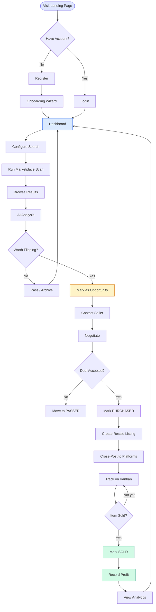

---

## 2. Registration & Onboarding

### 2a. Registration Flow

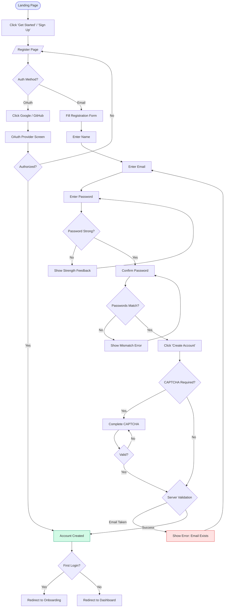

### 2b. Onboarding Wizard

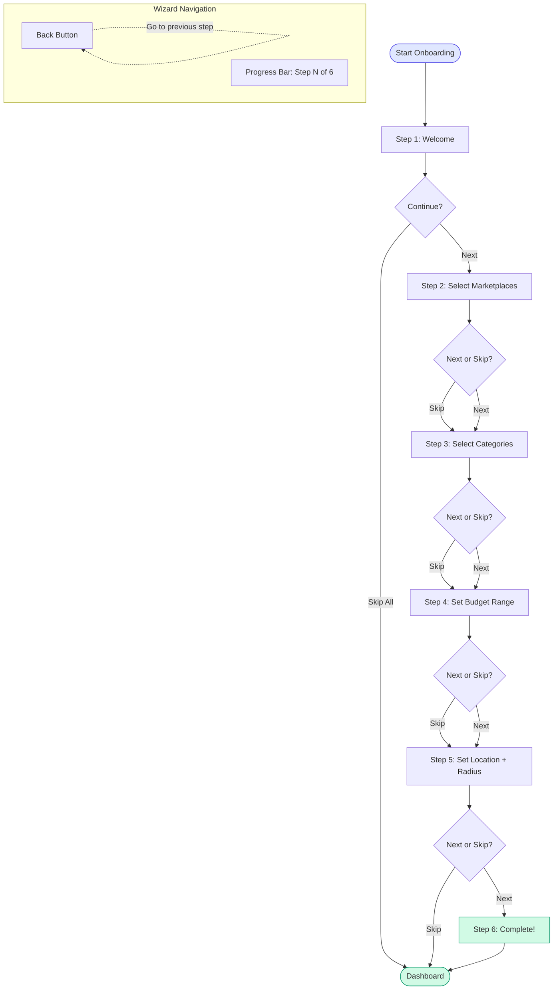

---

## 3. Login & Authentication

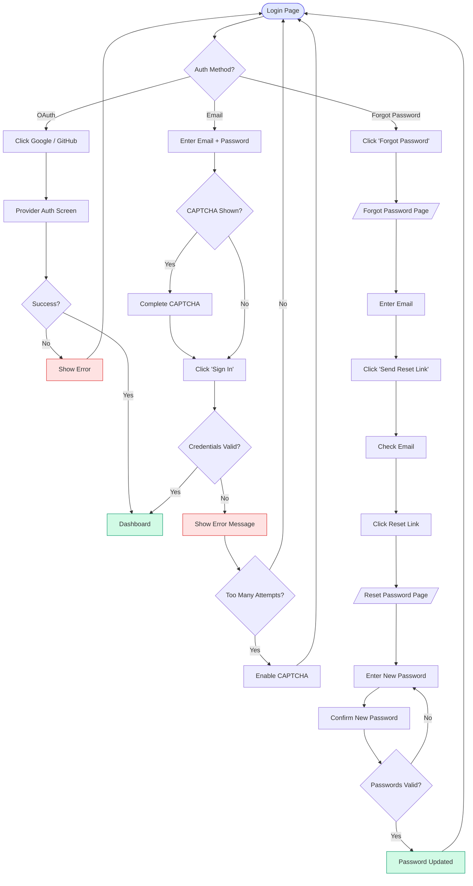

---

## 4. Core Flip Journey

The primary value loop — the reason the app exists.

```mermaid
flowchart TD
    FIND["FIND: Scan Marketplaces"]
    EVAL["EVALUATE: AI Analysis"]
    BUY["BUY: Contact & Purchase"]
    SELL["SELL: List for Resale"]
    PROFIT["PROFIT: Track & Record"]

    FIND --> EVAL
    EVAL --> BUY
    BUY --> SELL
    SELL --> PROFIT
    PROFIT -.->|"Repeat"| FIND

    subgraph find_detail ["Find Phase"]
        F1[Configure Search] --> F2[Select Platforms]
        F2 --> F3[Set Keywords + Filters]
        F3 --> F4[Run Scan]
        F4 --> F5[Review Results]
    end

    subgraph eval_detail ["Evaluate Phase"]
        E1[View Listing Details] --> E2[AI Value Score 0-100]
        E2 --> E3[Estimated Resale Value]
        E3 --> E4[Risk Assessment]
        E4 --> E5{Score >= 70?}
        E5 -->|Yes| E6[Auto-mark Opportunity]
        E5 -->|No| E7[Skip / Watch]
    end

    subgraph buy_detail ["Buy Phase"]
        B1[AI Drafts Message] --> B2[Review & Edit]
        B2 --> B3[Send to Seller]
        B3 --> B4[Negotiate]
        B4 --> B5[Agree on Price]
        B5 --> B6[Mark Purchased]
    end

    subgraph sell_detail ["Sell Phase"]
        S1[AI Generates Title + Description] --> S2[Set Resale Price]
        S2 --> S3[Select Platforms]
        S3 --> S4[Queue Cross-Posts]
        S4 --> S5[Monitor Listings]
    end

    subgraph profit_detail ["Profit Phase"]
        P1[Sale Confirmed] --> P2[Record Sale Price]
        P2 --> P3[Calculate Profit]
        P3 --> P4[Update Analytics]
    end

    style FIND fill:#dbeafe,stroke:#2563eb
    style EVAL fill:#fef3c7,stroke:#d97706
    style BUY fill:#ede9fe,stroke:#7c3aed
    style SELL fill:#ffedd5,stroke:#ea580c
    style PROFIT fill:#d1fae5,stroke:#059669
```

---

## 5. Marketplace Scanning

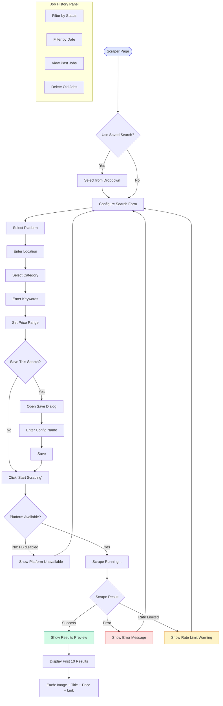

---

## 6. AI Analysis & Scoring

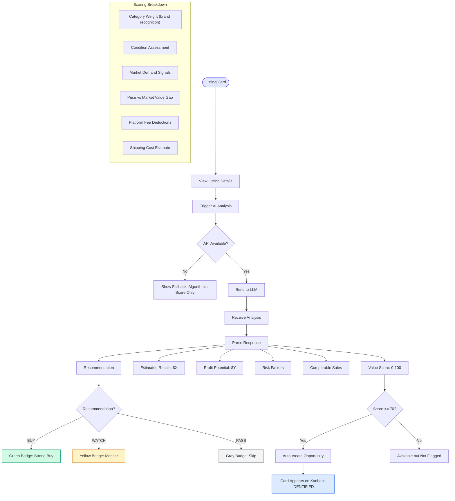

---

## 7. Kanban Lifecycle Tracking

```mermaid
flowchart LR
    subgraph IDENTIFIED ["IDENTIFIED"]
        direction TB
        I1["New opportunity\nfrom AI analysis"]
        I2["Value score shown"]
        I3["Actions: View, Edit, Delete"]
    end

    subgraph CONTACTED ["CONTACTED"]
        direction TB
        C1["Seller message sent"]
        C2["Waiting for reply"]
        C3["Negotiation active"]
    end

    subgraph PURCHASED ["PURCHASED"]
        direction TB
        P1["Deal accepted"]
        P2["Purchase price recorded"]
        P3["Ready to list"]
    end

    subgraph LISTED ["LISTED"]
        direction TB
        L1["Cross-posted"]
        L2["Resale URL added"]
        L3["Monitoring views"]
    end

    subgraph SOLD ["SOLD"]
        direction TB
        S1["Sale confirmed"]
        S2["Final price recorded"]
        S3["Profit calculated"]
    end

    IDENTIFIED -->|"Drag or\nSend Message"| CONTACTED
    CONTACTED -->|"Drag or\nMark Purchased"| PURCHASED
    PURCHASED -->|"Drag or\nCreate Listing"| LISTED
    LISTED -->|"Drag or\nConfirm Sale"| SOLD

    style IDENTIFIED fill:#dbeafe,stroke:#2563eb
    style CONTACTED fill:#fef3c7,stroke:#d97706
    style PURCHASED fill:#ede9fe,stroke:#7c3aed
    style LISTED fill:#ffedd5,stroke:#ea580c
    style SOLD fill:#d1fae5,stroke:#059669
```

### Status Transition Rules

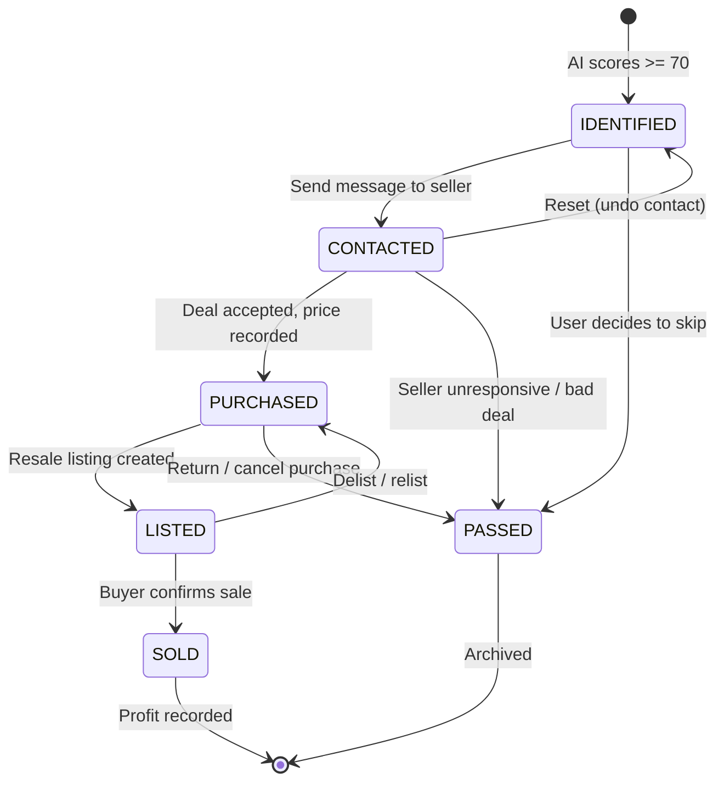

---

## 8. Seller Communication

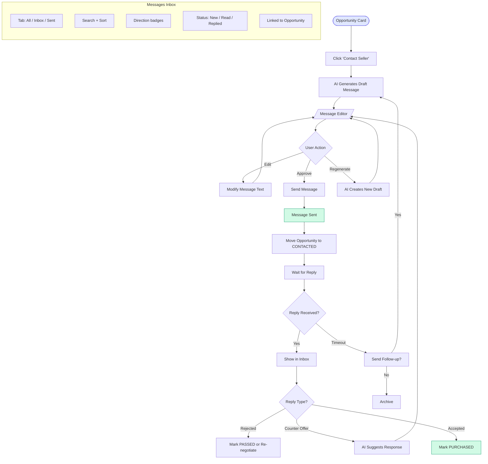

---

## 9. Cross-Platform Resale Listing

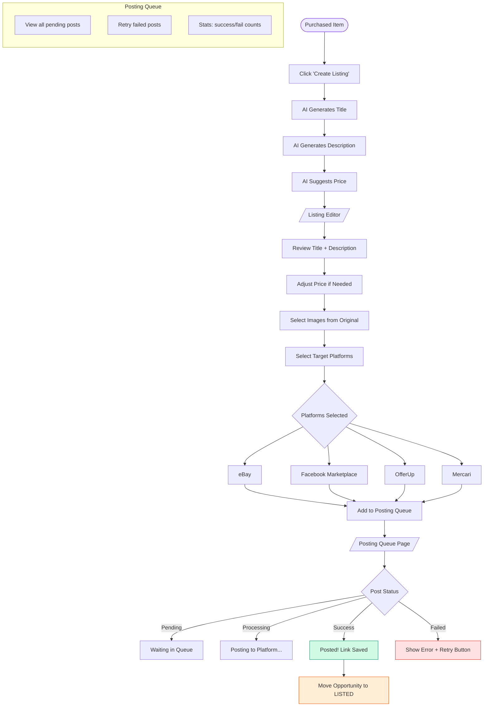

---

## 10. Analytics & Reporting

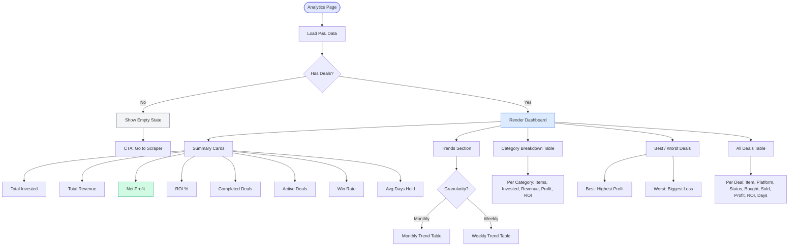

---

## 11. Settings & Profile

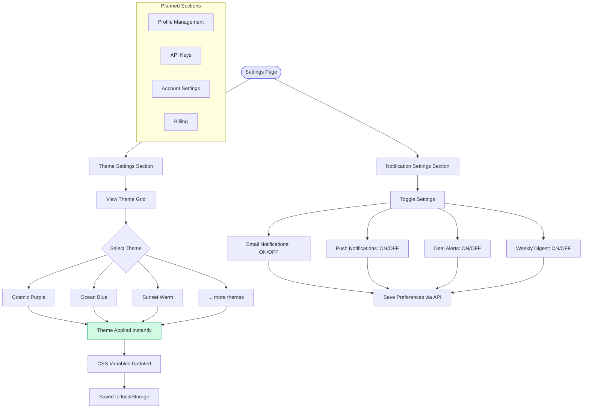

---

## 12. Subscription & Billing

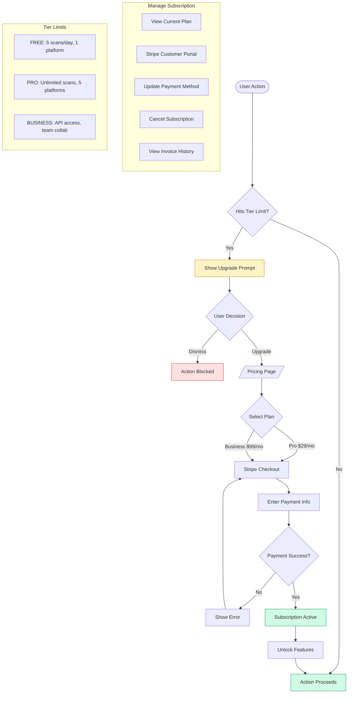

---

## Flow-to-Epic Traceability

| Flow | Epic | Stories | Status |
|------|------|---------|--------|
| Registration & Onboarding | Epic 2 | 2-1 through 2-6 | In Progress |
| Login & Authentication | Epic 2 | 2-1, 2-3, 2-4 | In Progress |
| Marketplace Scanning | Epic 3 | 3-1 through 3-9 | Backlog |
| AI Analysis & Scoring | Epic 4 | 4-1 through 4-6 | Backlog |
| Advanced Market Intel | Epic 5 | 5-1 through 5-5 | Backlog |
| Kanban Lifecycle | Epic 6 | 6-1 through 6-6 | Backlog |
| Subscription & Billing | Epic 7 | 7-1 through 7-4 | Backlog |
| Seller Communication | Epic 8 | 8-1 through 8-5 | Backlog |
| Cross-Platform Listing | Epic 9 | 9-1 through 9-4 | Backlog |
| Notifications | Epic 10-11 | 10-1 through 11-3 | Backlog |
| Settings & Profile | Epic 2 | 2-6 | Backlog |

---

*End of user flow diagrams. Render with any Mermaid-compatible markdown viewer (GitHub, VS Code Mermaid extension, Notion, etc.)*
