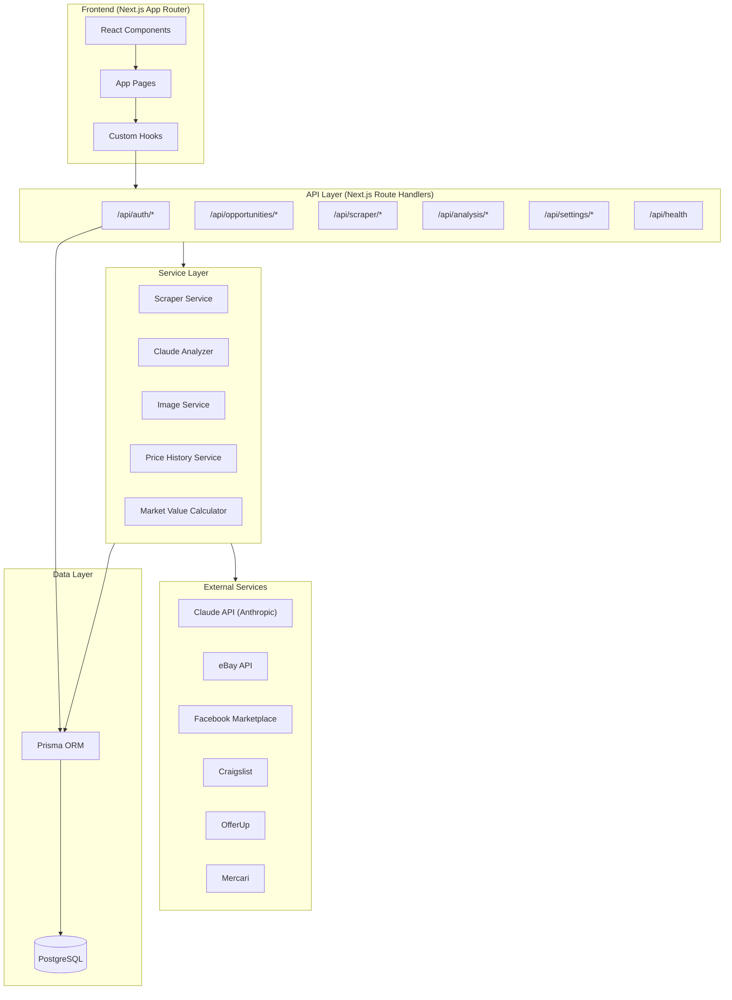
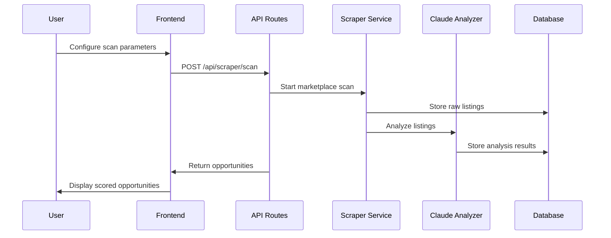
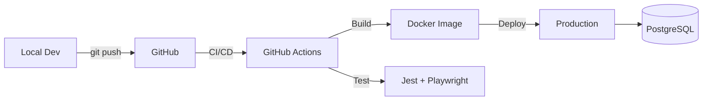

# 🏗️ Flipper AI — Architecture

**Author:** Stephen Boyett
**Company:** Axovia AI
**Version:** 1.0.0

---

## System Overview

## Component Details

### Frontend
- **Framework:** Next.js 16 with App Router & Turbopack
- **Styling:** Tailwind CSS + shadcn/ui components
- **State:** React hooks + server components
- **Auth UI:** NextAuth.js with credential provider

### API Layer
- **Pattern:** Next.js Route Handlers (`app/api/`)
- **Auth:** NextAuth.js session-based authentication
- **Validation:** Zod schemas for input validation

### Service Layer
- **Claude Analyzer:** AI-powered listing analysis (brand, condition, market value)
- **Image Service:** Image processing and analysis
- **Price History:** Historical price tracking and trend analysis
- **Market Value Calculator:** Weighted scoring for flip opportunities
- **Scraper Service:** Multi-platform listing scraper

### Data Layer
- **ORM:** Prisma with PostgreSQL adapter
- **Migrations:** Prisma Migrate for schema management
- **Models:** User, Listing, Opportunity, PriceHistory, Settings

## Data Flow

## Deployment

- **CI/CD:** GitHub Actions (lint, test, build, deploy)
- **Container:** Docker multi-stage build
- **Database:** PostgreSQL (Cloud SQL or managed)
- **Hosting:** Vercel / Docker deployment
